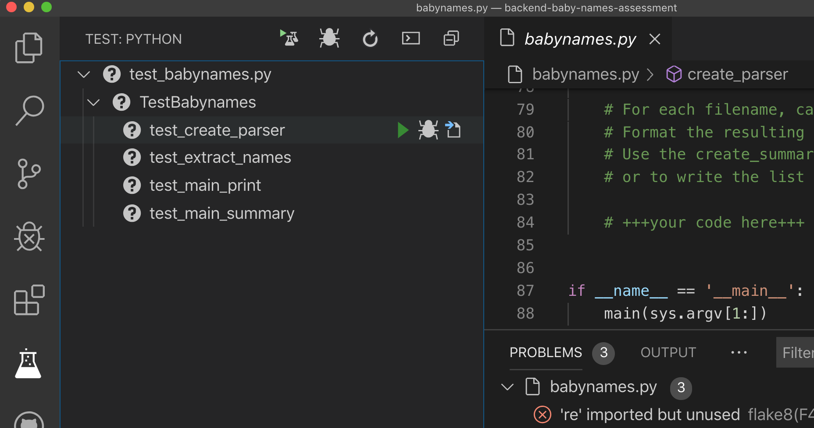
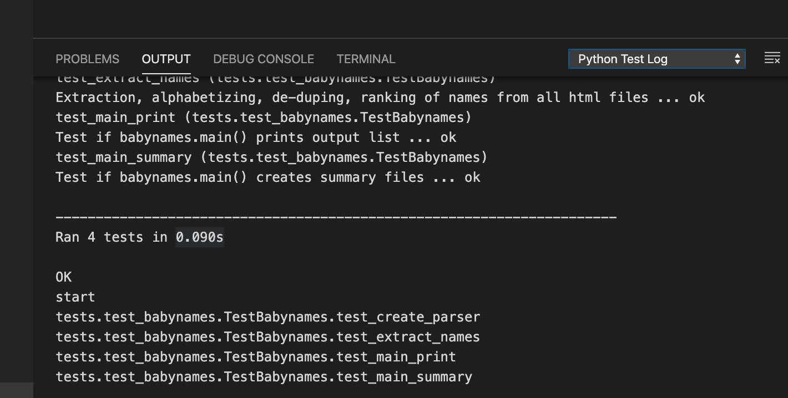

Baby Names 
------------

The Social Security administration has this neat data by year of what names are most popular for babies born that year in the USA (see [social security baby names](http://www.socialsecurity.gov/OACT/babynames/)).   The files `baby1990.html baby1992.html` ... contain raw html, similar to what you get visiting the above social security site. Take a look at the html and think about how you might scrape the data out of it.

You will need to add your own code to [babynames.py](./babynames.py) to complete the assignment.

Part A
------

In the [babynames.py](./babynames.py) file, implement the `extract_names(filename)` function which takes the filename of a single `babyXXXX.html` file and returns the data from the file as a single list -- the year string at the start of the list followed by the name-rank strings in alphabetical order. Make sure the returned list is a pure python list, not a 'stringified' version of the list.
```
['2006', 'Aaliyah 91', 'Abagail 895', 'Aaron 57', ...] 
```
Modify `main(args)` so it calls your `extract_names(filename)` function and prints what it returns (main already has the code for the command line argument parsing). If you get stuck working out the regular expressions for the year and each name, solution regular expression patterns are shown at the end of this readme. Note that for parsing webpages in general, regular expressions don't do a good job, but these webpages have a simple and consistent format.

Rather than treat the boy and girl names separately, we'll just lump them all together. In some years, a name appears more than once in the html, but we'll just use one rank number per name. 

Build the program as a series of small milestones, getting each step to run/print something before trying the next step. This is the pattern used by experienced programmers -- build a series of incremental milestones, each with some output to check, rather than building the whole program in one huge step.

Printing the data you have at the end of one milestone helps you think about how to re-structure that data for the next milestone. Python is well suited to this style of incremental development. For example, first get it to the point where it extracts and prints the year. Here are some suggested milestones:

*   Extract all the text from the file and print it
*   Find and extract the year and print it
*   Extract the names and rank numbers and print them
*   Get the names data into a dict and print it
*   Build the `[year, 'name rank', ... ]` list and print it
*   Fix `main()` to use the extracted_names list

Earlier we have had functions just print to stdout. It's more re-usable to have the function *return* the extracted data, so then the caller has the choice to print it or do something else with it. (You can still print directly from inside your functions for your little experiments during development.) This illustrates the principle of _Separation of Concerns_.  Have one function that delivers the data, and a different one to print or write the the data to a file.  This builds 'modularity' into your program so that it is easier to maintain.

Have `main()` call `extract_names()` for each command line argument and print the results vertically. To make the list into a reasonable looking summary text, here's a clever use of join: `text = '\n'.join(mylist) + '\n'`

The summary text should look like this for each file:
```
2006
Aaliyah 91
Aaron 57
Abagail 895
Abbey 695
Abbie 650
...
```

Part B
------

Suppose instead of printing the text to stdout, we want to write files containing the text. If the flag `--summaryfile` is present on the command line, do the following: for each input file `babyXXXX.html`, instead of printing to standard output, write a new file `babyXXXX.html.summary` that contains the summary text for that file.

Once the `--summaryfile` feature is working, run the program on all the files using `*` like this:  
`python babynames.py --summaryfile baby*.html`.  
This generates all the summaries in one step. (The standard behavior of the shell is that it expands the `baby*.html` pattern into the list of matching filenames, and then the shell runs babynames.py, passing in all those filenames in the `sys.argv` list.)

With the data organized into summary files, you can see patterns over time with shell commands, like this:
```
$ grep 'Trinity ' *.summary
$ grep 'Nick ' *.summary
$ grep 'Miguel ' *.summary
$ grep 'Emily ' *.summary
```

**Regular expression hints**
- year:  `r'Popularity\sin\s(\d\d\d\d)`
- names: `r'<td>(\d+)</td><td>(\w+)</td><td>(\w+)</td>'`

## Testing your code
Use the VSCode debugger for this assignment-- the debugger is your primary tool as a developer.  Have you heard of a carpenter that doesn't know how to use his own hammer?  Would you hire that guy?  If you need help on this assessment, *be sure you are able to run it in the debugger before asking for coach help.*

This assignment contains a `tests` folder that will test your code in several different ways.  Make sure you are passing all the tests before you submit your work!  There are a couple of ways to test.
 - From the command line:
   `$ python -m unittest discover`
 - Using the built-in TDD framework of VSCode.  Read [this article](https://code.visualstudio.com/docs/python/testing) and understand how to enable the framework in your VSCode IDE.  Once the framework is enabled, you can run and debug any of the tests individually.
 
 To view the detailed results of the test output, select the OUTPUT tab in your integrated terminal window, and then choose "Python Test Log" in the dropdown.
 
 - You may encounter this error message during testing:
    ```self.assertListEqual(output, baby1990_list)
    AssertionError: Lists differ: ['1990', 'Aaron 34', 'Abbey 48... != ['1990', 'Aaron 34', 'Abbey 48...
    First differing element 14:
    'Adrian 603'
    'Adrian 94'
    ```
    This means that you are not handling duplicate names correctly-- keep the rank of the first name that you encounter during parsing.  If you see a duplicate name with a different rank, don't add it to your dictionary of names & ranks.  

## PR (Pull Request) Workflow for this Assignment
1. *Fork* this repository into your own personal github account.
2. Then *Clone* your own repo to your local development machine.
3. Create a separate branch named `dev`, and checkout the branch.
5. Commit your changes, then `git push` the branch back to your own github account.
5. From your own Github repo, create a pull request (PR) from your `dev` branch back to your own master.
6. Copy/Paste the URL **link to your PR** as your assignment submission.
7. Your grader will post code review comments inline with your code, in your github account. Be sure to respond to any comments and make requested changes. **RESUBMIT** a new link to your PR after making changes.  This is the code review iteration cycle.
